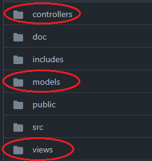
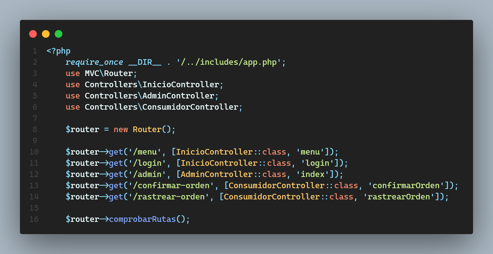

# Arquitectura del Sistema

## Estructura de carpetas
La arquitectura del sistema está basada en el patrón de diesño MVC (Model - View - Controller), la cual, consiste en una lógica que divide en 3 segmentos de código el sistema:
1. Model: Se refiere a los modelos, es decir, una abstracción en clases de las tablas de la base de datos.
2. View: Es una sección en la que se aloja el código de las interfaces gráficas de la aplicación.
3. Controller: Los controladores, fungen como unión entre los modelos y las vistas, es decir, pide la información de la base de datos al modelo para después enviarla a la vista y que esta la renderice.  

Las carpetas de lo anterior podemos visualizarlas en la raíz del proyecto:  

Aunado a lo anterior, se diseñó una clase llamada Router, en la cual, implementamos una función llamada comprobarRutas, la cual nos permite enlazar rutas GET y rutas POST a funciones que renderizan una vista.
El listado de rutas se define en public/index.php:  

## Carpeta de despliegue: 
La carpeta que fungirá como raíz de la aplicación es la carpeta public.

## Funcionamiento del MVC 
El flujo sería el siguiente: 
 - El usuario accede a la ruta X
 - En index.php se ejecuta la función comprobarRutas, si la ruta ingresada en la barra de URLs es válida, entonces se ejecutará una función que renderiza la vista asignada a esta ruta.
 - (Caso alternativo) De otro modo, si la ruta no está registrada en el index, se renderiza un 404.
 - De ser válida la ruta, el controlador le pide la información al modelo que sea necesario, para posteriormente enviar estos datos a la vista que será la encargada de renderizar lo que el modelo dio como respuesta.

**Cabe destacar que lo anterior se realizó haciendo uso del paradigma de programación orientado a objetos**
