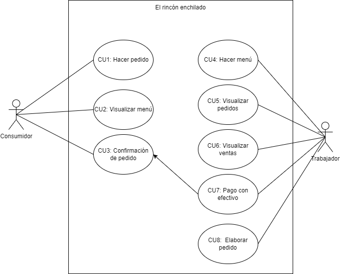

# Casos de uso

En el siguiente diagrama de casos de uso, se define el límite de sistema y determina lo que se considera externo o interno al sistema. Además, muestra los actores que interactuarán con el sistema.

