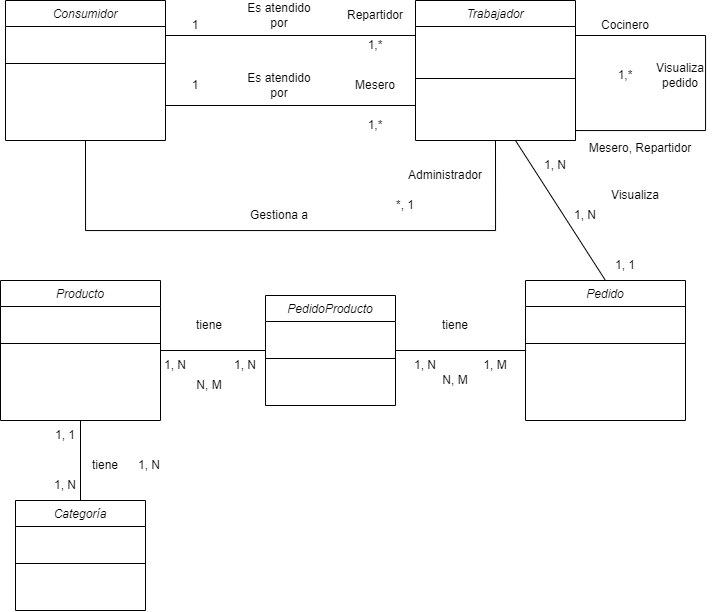

# VISTA DE INFORMACIÓN

## Modelo de dominio.

### Modelo de datos (Diagrama E-R)
El siguiente diagrama específica que se implementará (en un modelo de datos físicos).

Con ayuda del gestor de base de datos, MySQL, se obtuvo el siguiente diagrama ER

## Tarjetas CRC.

### Clases del dominio (Clases del dominio)
A pesar de que el sistema se implementará bajo el platrón de diseño MVC, se puede seguir la siguiente abstracción: 

